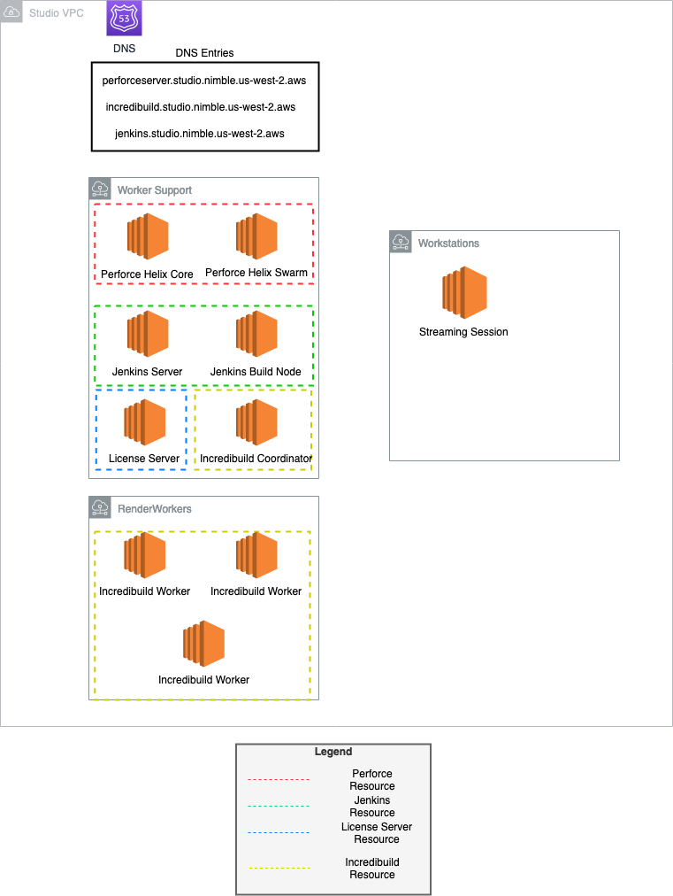

## Nimble Studio Game Development Suite

This repository is a collection of CDK applications to help you build and customize
game development tools for use with your Amazon Nimble Studio.

The included applications consist of:
* [Perforce Helix Core](https://www.perforce.com/products/helix-core) and [Perforce Helix Swarm](https://www.perforce.com/products/helix-swarm) Setup
* [Incredibuild](https://www.incredibuild.com/) Coordinator and Incredibuild Agent Workers Setup
* [License Server](https://docs.aws.amazon.com/nimble-studio/latest/userguide/creating-license-server.html) Setup
* [Jenkins](https://www.jenkins.io/) Automation Server and Build Node Setup

The architecture for the entire suite of applications deployed within a Nimble Studio is represented below:



### Demo Video

[](https://www.youtube.com/watch?v=zfkHi1ft25I)

### Getting Started

#### Prerequisites

##### Nimble Studio
This project requires that you have already have an [AWS Nimble Studio](https://docs.aws.amazon.com/nimble-studio/latest/userguide/getting-started.html) created, and is designed to work with the network configuration deployed by 
[StudioBuilder](https://docs.aws.amazon.com/nimble-studio/latest/userguide/deploy-studio.html).

##### Git
* Install [git](https://git-scm.com/book/en/v2/Getting-Started-Installing-Git)

##### Python 3.x
* Install [Python](https://www.python.org/downloads/)

##### AWS
* An AWS account
* [AWS CLI](https://docs.aws.amazon.com/cli/latest/userguide/install-cliv2.html)
* AWS CLI [configured](https://docs.aws.amazon.com/cli/latest/userguide/cli-configure-quickstart.html#cli-configure-quickstart-config)
* [AWS CDK](https://docs.aws.amazon.com/cdk/latest/guide/getting_started.html)

#### Precaution

By deploying this project into an AWS account, it will exceed Free Tier. To avoid unnecessary charges, clean up the environment when you finish testing the project.

The majority of the AWS resource cost from these CDK applications will come from the running EC2 instances as depicted in the architecture diagram.

For more information on AWS resource costs and pricing estimations, visit the [AWS Pricing page](https://aws.amazon.com/pricing/).

#### Setup

First, clone the repository to a local working directory:

```bash
git clone https://github.com/aws-samples/nimblestudio-game-development-suite
```

Navigate into the project directory:

```bash
cd nimblestudio-game-development-suite
```

This project is set up like a standard Python project.  The initialization
process also creates a virtualenv within this project, stored under the `.venv`
directory.  To create the virtualenv it assumes that there is a `python3`
(or `python` for Windows) executable in your path with access to the `venv`
package. If for any reason the automatic creation of the virtualenv fails,
you can create the virtualenv manually.

To manually create a virtualenv on MacOS and Linux:

```
python3 -m venv .venv
```

After the init process completes and the virtualenv is created, you can use the following
step to activate your virtualenv.

```
source .venv/bin/activate
```

If you are a Windows platform, you would activate the virtualenv like this:

```
.venv\Scripts\activate.bat
```

Once the virtualenv is activated, you can install the required dependencies.

```
pip install -r requirements.txt
```

#### Modular Deployment

This repository consists of multiple CDK applications within individual directories. For synthesis and deployment, 
navigate into the directory for the application you wish to deploy, and follow the README instructions within that
folder.

For example, to get started with deploying the Perforce CDK application:

```bash
cd nimble_studio_game_development_suite/nimble_studio_perforce_server
```

The proper deployment order for all applications is as follows:

1. nimble_studio_perforce_server
1. nimble_studio_build_farm
1. nimble_studio_build_pipeline
1. nimble_studio_license_server

#### Clean Up

The `cdk destroy` command is the fastest method to clean up resources created by CDK applications. You can run this command within the directory of the application intended to be cleaned up. 

A common error that prevents deletion is 'X has dependencies'. If you see this kind of message, read error messages and delete resources manually before running destroy command again. You can also delete stacks in AWS Cloudformation console. 

Destroy the CDK applications in the reverse order of deployment to best avoid dependency issues.

## Security

See [CONTRIBUTING](CONTRIBUTING.md#security-issue-notifications) for more information.

## License

This library is licensed under the MIT-0 License. See the LICENSE file.
